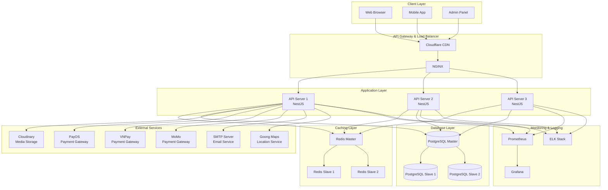

# Audio Tài Lộc System Architecture

## Overview

This document describes the system architecture of Audio Tài Lộc e-commerce platform.

## Architecture Diagram



## Component Details

### 1. Client Layer
- **Web Browser**: React-based SPA for desktop/mobile web
- **Mobile App**: React Native application (iOS/Android)
- **Admin Panel**: React-based administrative interface

### 2. CDN & Load Balancing
- **Cloudflare**: Global CDN, DDoS protection, SSL termination
- **NGINX**: Reverse proxy, load balancing, rate limiting

### 3. Application Layer
- **NestJS API Servers**: Horizontal scaling with 3+ instances
- **Features**: JWT auth, WebSocket support, RESTful APIs
- **Process Manager**: PM2 for process management

### 4. Caching Layer
- **Redis Cluster**: Master-slave replication
- **Use Cases**: Session storage, cart data, API response caching
- **TTL Strategy**: Variable TTL based on data type

### 5. Database Layer
- **PostgreSQL**: Primary data store with master-slave replication
- **Prisma ORM**: Type-safe database access
- **Connection Pooling**: PgBouncer for connection management

### 6. External Services
- **Cloudinary**: Image optimization and CDN delivery
- **Payment Gateways**: Multiple providers for redundancy
- **Email Service**: Transactional emails via SMTP
- **Goong Maps**: Vietnamese location services

### 7. Monitoring & Observability
- **Prometheus**: Metrics collection
- **Grafana**: Visualization and alerting
- **ELK Stack**: Centralized logging

## Data Flow

### 1. Request Flow
```
Client → Cloudflare → NGINX → API Server → Cache/DB → Response
```

### 2. Payment Flow
```
Client → API → Payment Gateway → Webhook → Database → Notification
```

### 3. Order Processing
```
Cart → Order Creation → Payment → Inventory Update → Email Notification
```

## Security Architecture

### Network Security
- SSL/TLS encryption (Let's Encrypt)
- Cloudflare WAF rules
- Private network for internal services
- VPN access for administration

### Application Security
- JWT with refresh tokens
- Rate limiting per endpoint
- Input validation & sanitization
- SQL injection prevention (Prisma)
- XSS protection (Helmet.js)

### Data Security
- Encryption at rest (database)
- Encryption in transit (SSL/TLS)
- PCI compliance for payments
- GDPR compliance for user data

## Scalability Strategy

### Horizontal Scaling
- Stateless API servers
- Redis cluster for session management
- Database read replicas
- CDN for static assets

### Vertical Scaling
- Auto-scaling based on CPU/memory
- Database connection pooling
- Query optimization
- Caching strategy

## Disaster Recovery

### Backup Strategy
- Daily automated database backups
- Real-time replication to standby
- S3 storage for long-term retention
- Point-in-time recovery capability

### High Availability
- Multi-AZ deployment
- Health checks and auto-recovery
- Blue-green deployment strategy
- Zero-downtime deployments

## Performance Optimization

### API Performance
- Response time < 200ms (p95)
- Gzip compression
- HTTP/2 support
- Connection keep-alive

### Database Performance
- Indexed queries
- Query optimization
- Connection pooling
- Read replica routing

### Caching Strategy
- Redis for hot data
- CDN for static assets
- Browser caching headers
- API response caching

## Development Workflow

### CI/CD Pipeline
```
Git Push → GitHub Actions → Tests → Build → Docker Registry → Deploy
```

### Environments
- **Development**: Local Docker setup
- **Staging**: Mirrors production
- **Production**: Blue-green deployment

## Technology Stack Summary

| Layer | Technology | Purpose |
|-------|------------|---------|
| Frontend | React, Next.js | Web application |
| Mobile | React Native | Mobile apps |
| API | NestJS | Backend services |
| Database | PostgreSQL | Primary datastore |
| Cache | Redis | Performance optimization |
| Search | PostgreSQL FTS | Product search |
| Queue | Redis/Bull | Background jobs |
| Storage | Cloudinary | Media management |
| Monitoring | Prometheus/Grafana | System observability |
| Logging | ELK Stack | Log aggregation |
| Container | Docker | Application packaging |
| Orchestration | Docker Compose | Container management |
| CI/CD | GitHub Actions | Automation |

## Future Considerations

### Planned Enhancements
1. Kubernetes migration for orchestration
2. ElasticSearch for advanced search
3. GraphQL API gateway
4. Microservices architecture
5. Event-driven architecture with Kafka

### Scaling Roadmap
1. Database sharding strategy
2. Multi-region deployment
3. Edge computing with Cloudflare Workers
4. Real-time analytics pipeline
5. Machine learning recommendations

---

**Last Updated**: December 2024
**Version**: 1.0.0
**Maintained By**: Technical Architecture Team
